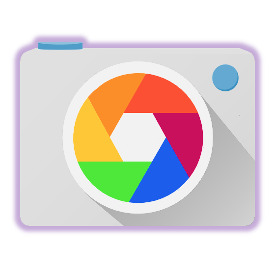

<h1 align="center">
   Welcome to KLICK-The Screenshot App
</h1>

Testing the accuracy of the code is the most integral part of our work. Now that we save the screenshots too, there have been discussions/brainstorming on the easiest way to get this done.

Here it comes!
Klick!

Trust me, saving screenshots using this app is as easy as it's name! 
You can watch the video and get going. 

<strong>P.S. Installing this too does not require admin rights </strong>
<h2>Salient Features</h2>
<ol>
<li>It saves the screenshot in the selected folder directly.</li>
<li>It captures the whole screen with the codes running behind it as well.</li>
<li>It display the username of your system as a watermark on the screenshot.</li>
<li>The screenshots are not over written even if you close the application and run it again at the later stage.</li>
</ol>
<h3 id="definition-lists-can-be-used-with-html-syntax">About</h3>
<dl>
  <dt>Developer</dt>
  <dd>Danish Shaikh</dd>
  <dt>Published On</dt>
  <dd>August 2017</dd>
  <dt>Place</dt>
  <dd>Mumbai - India</dd>
</dl>
<section class="page-header">
    <a href="https://github.com/Danish-Shaikh786/KLICK/edit/master/" class="btn">Download .zip</a>
</section>

